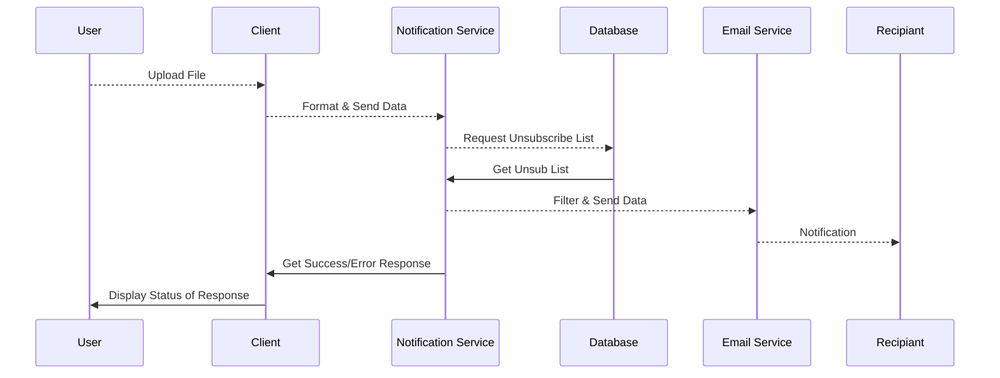
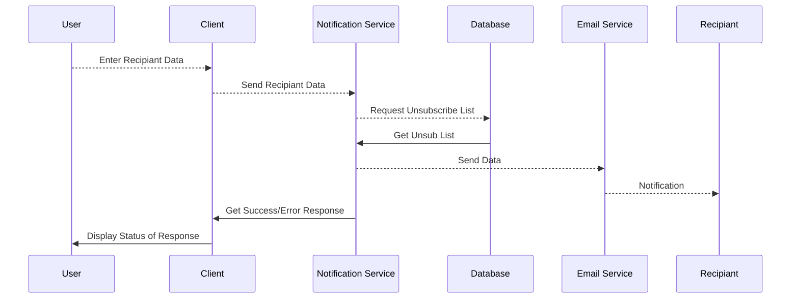
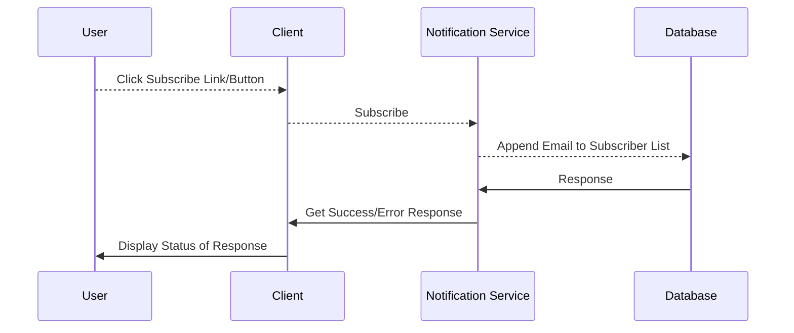
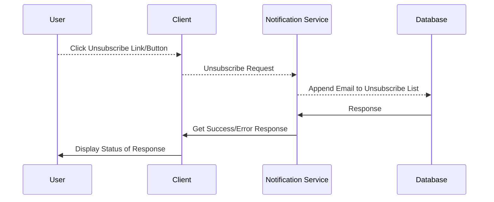
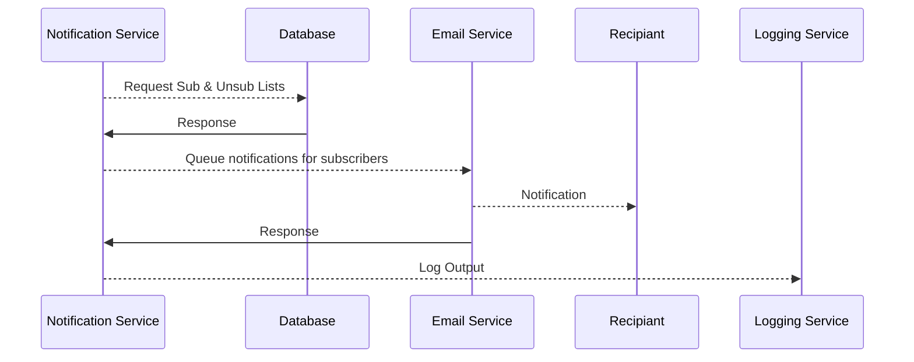

# Documentation for Notification Service

## Endpoints

## notify-many

An `admin`, `moderator`, and `speaker` can uplaod a file which can be parsed into an array of objects containing the relevant information to send out a single notification to all contacts who are not unsubscribed.



```typescript
router.post('/notify-many', async (req, res, next) => {
    try {
        const { data } = req.body as { data?: Array<Object> };
        const unsubList = await DB.getUnsubList();
        const { filteredData } = data.filter((item) => {
            return !unsubList.includes(item.email);
        });
        Email.notifyMany(filteredData);
        res.status(200).send();
    } catch (e) {
        next(e);
    }
});
```

## notify-one

An `admin`, `moderator`, and `speaker` can send out a notification to a single contact who is not unsubscribed.



```typescript
router.post('/notify-one', async (req, res, next) => {
    try {
        const { data } = req.body as { data?: Object };
        const unsubList = await DB.getUnsubList();
        if unsubList.includes(data.email)
          //Depends on how we plan to implement Subscriptions/Unsubscribing
          throw new ClientError('Cannot notify unsubscribed user')
        Email.notifyOne(data);
        res.status(200).send();
    } catch (e) {
        next(e);
    }
});
```

## subscribe

An `admin`, `moderator`, `speaker`, and `user` can subscribe to get notifications sent to their email.



```typescript
router.post('/subscribe', async (req, res, next) => {
    try {
        const { data } = req.body as { data?: Object };
        const unsubList = await DB.getUnsubList();
        if unsubList.includes(data.email)
          //Can simply take off of the unsub list to re-subscribe
          DB.removeFromUnsubList(data.email)
        DB.subscribeUser(data);
        res.status(200).send();
    } catch (e) {
        next(e);
    }
});
```

## unsubscribe (Embeded Info In Link)

An `admin`, `moderator`, `speaker`, and `user` can unsubscribe to prevent getting any notifications sent to their email. This should be doable via a link embedded into each email.



```typescript
router.post('/unsubscribe', async (req, res, next) => {
    try {
        const { data } = req.body as { data?: Object };
        DB.addToUnsubList(data.email);
        res.status(200).send();
    } catch (e) {
        next(e);
    }
});
```

## Scheduled Jobs

## Reminders/Notifications (Check every x time interval)



```typescript
const schedule = require('node-schedule');
//Run every 10 mins
const notificationJob = schedule.scheduleJob('*/10 * * * *', () => {
    //Fetch list of notifications that are within set time period
    //Fetch Unsubscribe list (perhaps can be cached if not updated)
    //Queue upcoming notifications for people who are subscribed
    //Log the results
});
```

## Permissions

`Roles: admin, moderator, speaker, user`
