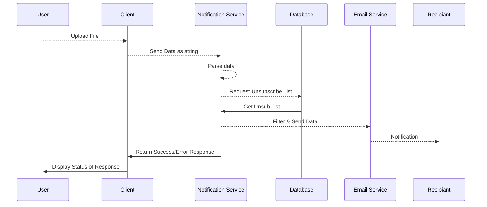
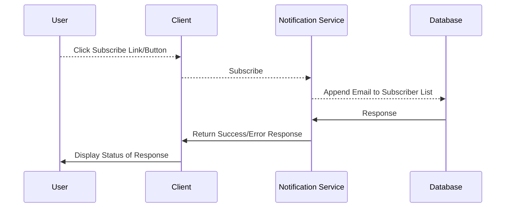
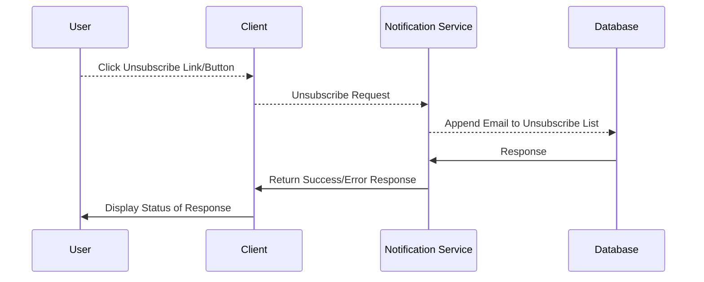
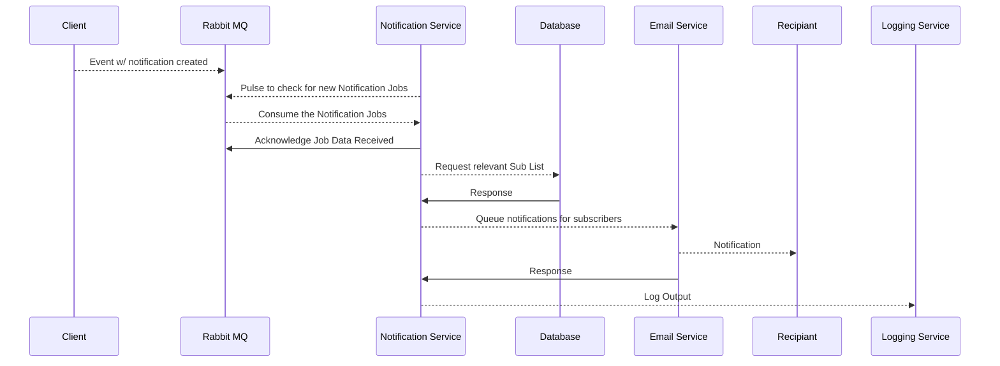

# Documentation for Notification Service

## Endpoints

## invite

An `admin`, `moderator`, and `speaker` can uplaod a file which can be parsed into an array of objects containing the relevant information to send out a single invitation to all contacts who are not unsubscribed.

## subscribe

An `admin`, `moderator`, `speaker`, and `user` can subscribe to get notifications sent to their email.

## unsubscribe (Embeded Info In Link)

An `admin`, `moderator`, `speaker`, and `user` can unsubscribe to prevent getting any notifications sent to their email. This should be doable via a link embedded into each email.

## Scheduled Jobs

## Reminders/Notifications (Using RabbitMQ)

## Permissions

`Roles: admin, moderator, speaker, user`
